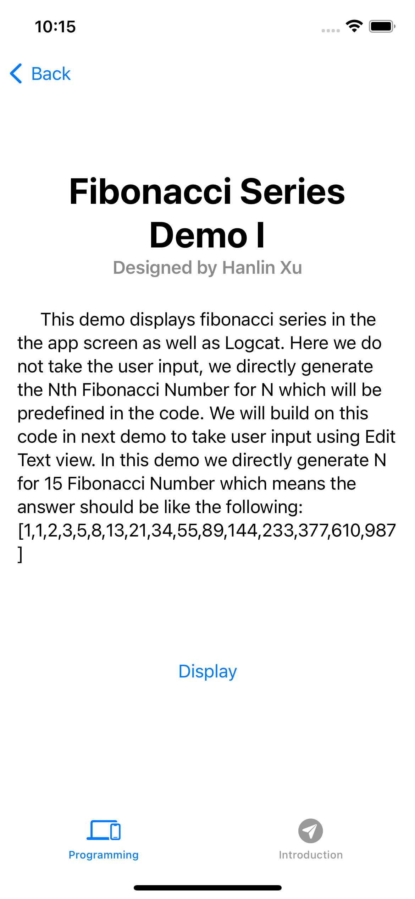
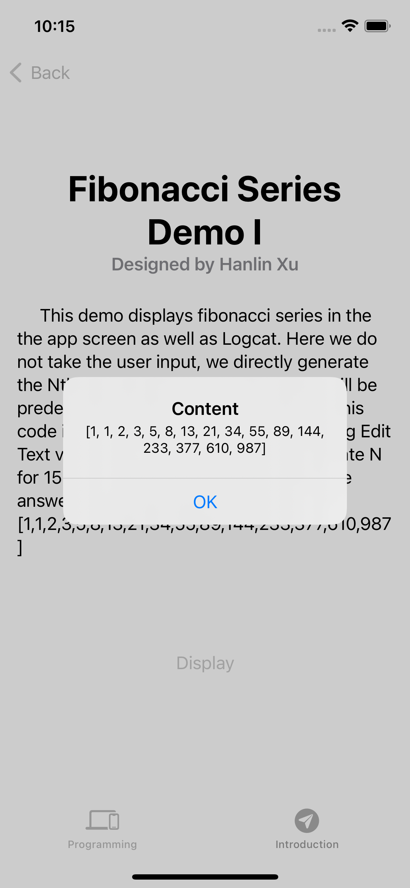

# Fibonacci series app

This demo displays fibonacci series in the the app screen as well as Logcat. Here we do not take the user input, we directly generate the Nth Fibonacci Number for N which will be predefined in the code. We will build on this code in next demo to take user input using Edit Text view. In this demo we directly generate N for 15 Fibonacci Number which means the answer should be like the following: [1,1,2,3,5,8,13,21,34,55,89,144,233,377,610,987]

## Code

```
import SwiftUI
import UIKit

public func fibForNumSteps(numSteps: Int) -> [Int] {
    var sequence = [1, 1]
    if numSteps <= 1{
        return sequence
    }
    for _ in 0...numSteps - 2{
        let first = sequence[sequence.count - 2]
        let second = sequence.last!
        sequence.append(first + second)
    }
    return sequence
}


struct Fibonacciseries1: View {
    @State var isAlert = false
    let content = fibForNumSteps(numSteps: 15).description
    init()
    {
        UITextView.appearance().backgroundColor = .clear
    }
        
    
    var body: some View {
        ScrollView{
            Text("Fibonacci Series Demo I")
                .font(.largeTitle)
                .fontWeight(.bold)
                .multilineTextAlignment(.center)
                .padding([.top, .leading, .trailing])
            
            Text("Designed by Hanlin Xu")
                .font(.headline)
                .foregroundColor(.secondary)
            
            Text("     This demo displays fibonacci series in the the app screen as well as Logcat. Here we do not take the user input, we directly generate the Nth Fibonacci Number for N which will be predefined in the code. We will build on this code in next demo to take user input using Edit Text view. In this demo we directly generate N for 15 Fibonacci Number which means the answer should be like the following: [1,1,2,3,5,8,13,21,34,55,89,144,233,377,610,987]")
                .font(.body)
                .multilineTextAlignment(.leading)
                .padding(.all)
            
            
            VStack{
                Spacer().frame(height: 50)
                Button("Display")
                {
                    self.isAlert = true
                }
                .alert(isPresented: $isAlert, content: {
                    Alert(title:Text("Content"),message: Text(content))
                })
            }.padding()
    }
    }
}

struct Fibonacciseries1_Previews: PreviewProvider {
    static var previews: some View {
        Fibonacciseries1()
    }
}
```

## Screenshots

Following are few screenshots of this demo.

**First screenshot is the interface of the demo.**



**Second screenshot is result of this demo.**


