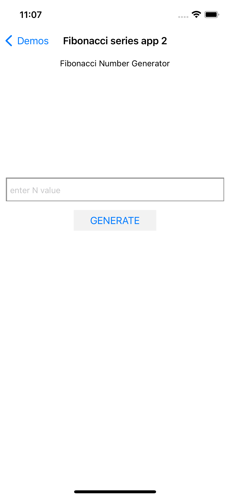
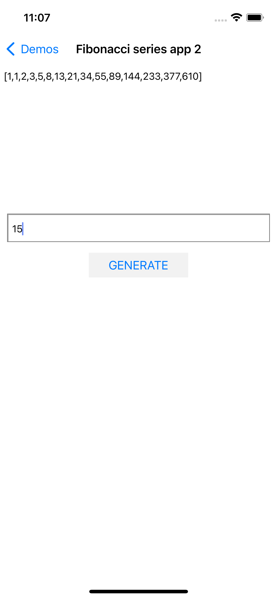
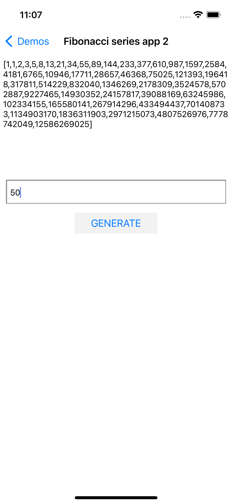

# Fibonacci series app

This demo displays fibonacci series in the the app screen. Here we do not take the user input, we directly generate the Nth Fibonacci Number for N which will be predefined in the code. We will build on this code in next demo to take user input using Edit Text view. This demo is based on the `Text Edit demo`.

## Code

When you build an project in objective-C, the xcode will generated the ".h" file automatically like this.

```
#import <UIKit/UIKit.h>

NS_ASSUME_NONNULL_BEGIN

@interface FibonacciViewController : UIViewController

@end

NS_ASSUME_NONNULL_END
```

The above code is for you to generate the interface-view controller.
In the following demos, all the ".h" will be the same except the project name, so I will not repeat in the following demos.

```
#import "FibonacciViewController.h"

@interface FibonacciViewController ()
@property (weak, nonatomic) IBOutlet UITextView *textView;
@property (weak, nonatomic) IBOutlet UITextField *enterTF;

@end

@implementation FibonacciViewController

- (void)viewDidLoad {
    [super viewDidLoad];
    // Do any additional setup after loading the view from its nib.
}
- (IBAction)generateClick:(id)sender {
    if ([self.enterTF.text intValue] <= 1) {
        UIAlertController *alert = [UIAlertController alertControllerWithTitle:@"Erron" message:@"Not a valid value of N" preferredStyle:UIAlertControllerStyleAlert];
        UIAlertAction *done = [UIAlertAction actionWithTitle:@"OK" style:(UIAlertActionStyleCancel) handler:nil];
        [alert addAction:done];
        [self presentViewController:alert animated:YES completion:nil];
        self.enterTF.text = nil;
    } else {
        NSArray *array = [self getFibonacciNum:[self.enterTF.text intValue]];
        NSMutableString *mutStr = [NSMutableString string];
        [mutStr appendString:@"["];
        for (NSString *str in array) {
            [mutStr appendFormat:@"%@,",str];
        }
        [mutStr deleteCharactersInRange:NSMakeRange(mutStr.length - 1, 1 )];
        [mutStr appendString:@"]"];
        self.textView.text = mutStr;
        self.textView.textAlignment = NSTextAlignmentLeft;
    }

    
}

- (NSArray *)getFibonacciNum:(int)value {
    NSMutableArray *array = [NSMutableArray array];
    for (int i = 0; i < value; i ++) {
        if (array.count == 0 || array.count == 1) {
            [array addObject:@"1"];
            continue;;
        }
        NSInteger num1 = [array.lastObject integerValue];
        NSInteger num2 = [array[array.count - 2] integerValue];
        [array addObject:[NSString stringWithFormat:@"%ld",num1 + num2]];
    }
    return array;
}
/*
#pragma mark - Navigation

// In a storyboard-based application, you will often want to do a little preparation before navigation
- (void)prepareForSegue:(UIStoryboardSegue *)segue sender:(id)sender {
    // Get the new view controller using [segue destinationViewController].
    // Pass the selected object to the new view controller.
}
*/

@end
```

## Screenshots

Following are few screenshots of this demo.

**First screenshot is the interface of the demo.**



**Second screenshot is result of this demo when N=15.**



**Third screenshot is result of this demo when N=50.**


