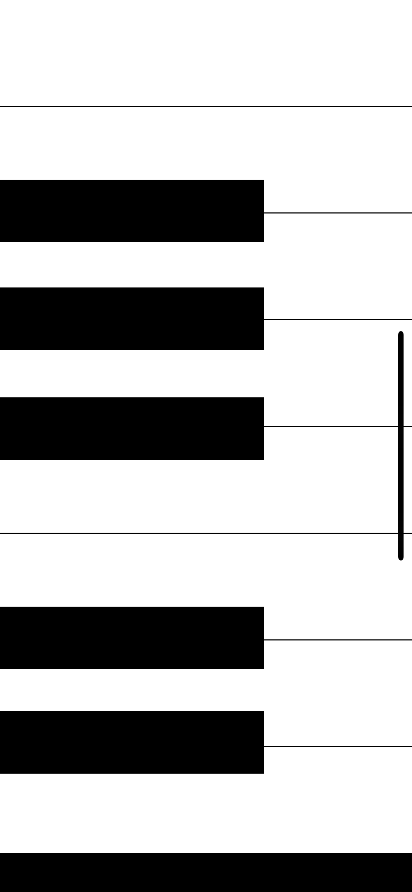

# Piano Simulator

This is a fun demo app, which is a piano simulator, when you press different keyboard, it will play different syllables，which represents A, C1, C, G, F, D, E, Fis, Dis, H, Gis, Cis, Ais. This demo is based on the liberary AVFoundation,  but you can try to play around with other liberary such as [AudioKIT](https://audiokit.io/).

## Code

**View Controller**

```
import UIKit
import AVFoundation

class ViewController: UIViewController {
    
    var player: AVAudioPlayer!
    
    override func viewDidLoad() {
        super.viewDidLoad()
        
    }
    
    
    @IBAction func keyPressed(_ sender: UIButton) {
        playSound(soundName: sender.currentTitle!)
        
        //Reduces the sender's (the button that got pressed) opacity to half.
        sender.alpha = 0.5
        
        //Code should execute after 0.2 second delay.
        DispatchQueue.main.asyncAfter(deadline: .now() + 0.2) {
            //Bring's sender's opacity back up to fully opaque.
            sender.alpha = 1.0
    }
        
        
        func playSound(soundName: String) {
            let url = Bundle.main.url(forResource: soundName, withExtension: "mp3")
            player = try! AVAudioPlayer(contentsOf: url!)
            player.play()
    
        
    }
   
}
}
```

**SceneDelegate**

```
import UIKit

class SceneDelegate: UIResponder, UIWindowSceneDelegate {

    var window: UIWindow?


    func scene(_ scene: UIScene, willConnectTo session: UISceneSession, options connectionOptions: UIScene.ConnectionOptions) {
        // Use this method to optionally configure and attach the UIWindow `window` to the provided UIWindowScene `scene`.
        // If using a storyboard, the `window` property will automatically be initialized and attached to the scene.
        // This delegate does not imply the connecting scene or session are new (see `application:configurationForConnectingSceneSession` instead).
        guard let _ = (scene as? UIWindowScene) else { return }
    }

    func sceneDidDisconnect(_ scene: UIScene) {
        // Called as the scene is being released by the system.
        // This occurs shortly after the scene enters the background, or when its session is discarded.
        // Release any resources associated with this scene that can be re-created the next time the scene connects.
        // The scene may re-connect later, as its session was not necessarily discarded (see `application:didDiscardSceneSessions` instead).
    }

    func sceneDidBecomeActive(_ scene: UIScene) {
        // Called when the scene has moved from an inactive state to an active state.
        // Use this method to restart any tasks that were paused (or not yet started) when the scene was inactive.
    }

    func sceneWillResignActive(_ scene: UIScene) {
        // Called when the scene will move from an active state to an inactive state.
        // This may occur due to temporary interruptions (ex. an incoming phone call).
    }

    func sceneWillEnterForeground(_ scene: UIScene) {
        // Called as the scene transitions from the background to the foreground.
        // Use this method to undo the changes made on entering the background.
    }

    func sceneDidEnterBackground(_ scene: UIScene) {
        // Called as the scene transitions from the foreground to the background.
        // Use this method to save data, release shared resources, and store enough scene-specific state information
        // to restore the scene back to its current state.
    }


}
```

**AppDelegate**

```
import UIKit

@main
class AppDelegate: UIResponder, UIApplicationDelegate {


    func application(_ application: UIApplication, didFinishLaunchingWithOptions launchOptions: [UIApplication.LaunchOptionsKey: Any]?) -> Bool {
        // Override point for customization after application launch.
        return true
    }

    // MARK: UISceneSession Lifecycle

    func application(_ application: UIApplication, configurationForConnecting connectingSceneSession: UISceneSession, options: UIScene.ConnectionOptions) -> UISceneConfiguration {
        // Called when a new scene session is being created.
        // Use this method to select a configuration to create the new scene with.
        return UISceneConfiguration(name: "Default Configuration", sessionRole: connectingSceneSession.role)
    }

    func application(_ application: UIApplication, didDiscardSceneSessions sceneSessions: Set<UISceneSession>) {
        // Called when the user discards a scene session.
        // If any sessions were discarded while the application was not running, this will be called shortly after application:didFinishLaunchingWithOptions.
        // Use this method to release any resources that were specific to the discarded scenes, as they will not return.
    }


}
```

## Screenshot

Following is the screenshot of this demo’s interface.


