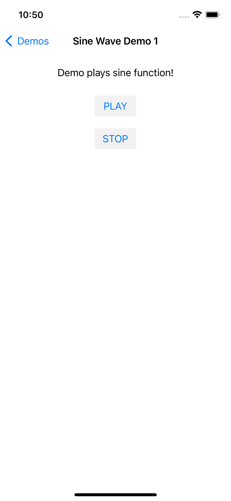

# Sine Wave Demo 1

This is a simple demo of sine wave generation. Sine wave generation is very similar to that used in the Lab. This demo makes use of AudioToolbox, we need to define the stream then call back the stream so that we could hear the sound.

There are two buttons defined in the layout. Start button is used to `Start` synthesizing and playing the sine wave generated and `Stop` button is used to stop the synthesis and playing the sine wave to the speaker.

## Code

```
#import "SineWaveDemo1UIViewController.h"
#import <AudioToolbox/AudioToolbox.h>

#define ARC4RANDOM_MAX      0x100000000


@interface SineWaveDemo1UIViewController () {
    double renderPhase;
    AudioUnit _ioUnit;
}

@end

@implementation SineWaveDemo1UIViewController
- (IBAction)playBtnClick:(id)sender {
    AudioOutputUnitStart(_ioUnit);
}
- (IBAction)stopBtnClick:(id)sender {
    AudioOutputUnitStop(_ioUnit);
}

- (void)dealloc {
    _ioUnit = NULL;
}

- (void)viewDidLoad {
    [super viewDidLoad];
    [self initAudioUnit];
}

- (void)initAudioUnit {
    
    AudioComponentDescription acd;
    acd.componentType = kAudioUnitType_Output;
    acd.componentSubType = kAudioUnitSubType_RemoteIO;
    acd.componentManufacturer = kAudioUnitManufacturer_Apple;
    acd.componentFlags = 0;
    acd.componentFlagsMask = 0;
    
    AudioComponent ioUnitRef = AudioComponentFindNext(NULL, &acd);
    OSStatus status = AudioComponentInstanceNew(ioUnitRef, &_ioUnit);
    
    UInt32   OUTPUT_BUS = 0;
    UInt32 flag = 1;
    if (flag) {
        status = AudioUnitSetProperty(_ioUnit, kAudioOutputUnitProperty_EnableIO, kAudioUnitScope_Output, OUTPUT_BUS, &flag, sizeof(flag));
    }
    
    AudioStreamBasicDescription asbd;
    asbd.mSampleRate = 44100;
    asbd.mFormatID         = kAudioFormatLinearPCM;
    asbd.mFormatFlags      = kLinearPCMFormatFlagIsSignedInteger;
    asbd.mFramesPerPacket  = 1; 
    asbd.mChannelsPerFrame = 1; 
    asbd.mBytesPerFrame    = sizeof(Float32); 
    asbd.mBytesPerPacket   = sizeof(Float32); 
    asbd.mBitsPerChannel   = sizeof(Float32) * 8; 
    
    UInt32   AOUTPUT_BUS = 0;
    AudioUnitSetProperty(_ioUnit, kAudioUnitProperty_StreamFormat, kAudioUnitScope_Input, AOUTPUT_BUS, &asbd, sizeof(asbd));
    
    AURenderCallbackStruct callBack;
    callBack.inputProc = PlayCallBack;
    callBack.inputProcRefCon = &renderPhase;
    status = AudioUnitSetProperty(_ioUnit, kAudioUnitProperty_SetRenderCallback, kAudioUnitScope_Output, OUTPUT_BUS, &callBack, sizeof(callBack));
}

OSStatus PlayCallBack(    void *                            inRefCon,
                      AudioUnitRenderActionFlags *    ioActionFlags,
                      const AudioTimeStamp *            inTimeStamp,
                      UInt32                            inBusNumber,
                      UInt32                            inNumberFrames,
                      AudioBufferList * __nullable    ioData) {
    
    double currentPhase = *((double *)inRefCon);
    Float32 * outputBuffer = (Float32 *)ioData->mBuffers[0].mData;
    const double frequency = 440.;
    const double phaseStep = (frequency / 44100.) * (M_PI * 2.);
    
    for(int i = 0; i < inNumberFrames; i++) {
        outputBuffer[i] = sin(currentPhase);
//        outputBuffer[i] =  ((double)arc4random() / ARC4RANDOM_MAX);
        currentPhase += phaseStep;
    }
    for(int i = 1; i < ioData->mNumberBuffers; i++) {
        memcpy(ioData->mBuffers[i].mData, outputBuffer, ioData->mBuffers[i].mDataByteSize);
    }
    *((double *)inRefCon) = currentPhase;
    return noErr;
    
    /*
    // inRefCon is the context pointer we passed in earlier when setting the render callback
        double currentPhase = *((double *)inRefCon);
        // ioData is where we're supposed to put the audio samples we've created
        Float32 * outputBuffer = (Float32 *)ioData->mBuffers[0].mData;
        const double frequency = 440.;
        const double phaseStep = (frequency / 44100.) * (M_PI * 2.);
     
        for(int i = 0; i < inNumberFrames; i++) {
            outputBuffer[i] = sin(currentPhase);
            currentPhase += phaseStep;
        }
     
        // If we were doing stereo (or more), this would copy our sine wave samples
        // to all of the remaining channels
        for(int i = 1; i < ioData->mNumberBuffers; i++) {
            memcpy(ioData->mBuffers[i].mData, outputBuffer, ioData->mBuffers[i].mDataByteSize);
        }
     
        // writing the current phase back to inRefCon so we can use it on the next call
        *((double *)inRefCon) = currentPhase;
        return noErr;
     */
}


@end

```

## Screenshot

Following is the screenshot of this demo's interface.


