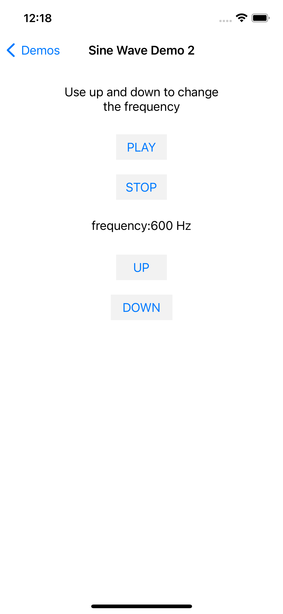

# Sine Wave Demo 2 

This demo is very similar to the Sine Wave Demo - 1, the only difference in this demo is that we are able to control the frequency of the sine wave generated using two buttons. Up button is used to increase the frequency by 10 Hz and the down button is used to decrease the frequency by 10 Hz.

## Code

```
#import "SineWaveDemo2UIViewController.h"
#import <AudioToolbox/AudioToolbox.h>

@interface SineWaveDemo2UIViewController () {
    double renderPhase;
    AudioUnit _ioUnit;
    double frequency;
}
@property (weak, nonatomic) IBOutlet UILabel *frequencyLabel;

@end

@implementation SineWaveDemo2UIViewController

- (void)dealloc {
    _ioUnit = NULL;
}

- (void)viewDidLoad {
    [super viewDidLoad];
    frequency = 440.;
    [self initAudioUnit];
}
- (IBAction)playClick:(id)sender {
    AudioOutputUnitStart(_ioUnit);
}
- (IBAction)stopClick:(id)sender {
    AudioOutputUnitStop(_ioUnit);
}
- (IBAction)upClick:(id)sender {
    if (frequency > 20000.0) {
        return;
    }
    frequency += 10;
    self.frequencyLabel.text = [NSString stringWithFormat:@"frequency:%.0f Hz",frequency];
}
- (IBAction)downClick:(id)sender {
    if (frequency < 1.0 ) {
        return;
    }
    frequency -= 10;
    self.frequencyLabel.text = [NSString stringWithFormat:@"frequency:%.0f Hz",frequency];
}

- (void)initAudioUnit {
    
    AudioComponentDescription acd;
    acd.componentType = kAudioUnitType_Output;
    acd.componentSubType = kAudioUnitSubType_RemoteIO;
    acd.componentManufacturer = kAudioUnitManufacturer_Apple;
    acd.componentFlags = 0;
    acd.componentFlagsMask = 0;
    
    AudioComponent ioUnitRef = AudioComponentFindNext(NULL, &acd);
    OSStatus status = AudioComponentInstanceNew(ioUnitRef, &_ioUnit);
    
    UInt32   OUTPUT_BUS = 0;
    UInt32 flag = 1;
    if (flag) {
        status = AudioUnitSetProperty(_ioUnit, kAudioOutputUnitProperty_EnableIO, kAudioUnitScope_Output, OUTPUT_BUS, &flag, sizeof(flag));
    }
    
    AudioStreamBasicDescription asbd;
    asbd.mSampleRate = 44100;
    asbd.mFormatID         = kAudioFormatLinearPCM;
    asbd.mFormatFlags      = kLinearPCMFormatFlagIsSignedInteger;
    asbd.mFramesPerPacket  = 1; // 每帧只有1个packet
    asbd.mChannelsPerFrame = 1; // 声道数
    asbd.mBytesPerFrame    = sizeof(Float32); // 每帧只有2个byte 声道*位深*Packet数
    asbd.mBytesPerPacket   = sizeof(Float32); // 每个Packet只有2个byte
    asbd.mBitsPerChannel   = sizeof(Float32) * 8; // 位深
    
    UInt32   AOUTPUT_BUS = 0;
    AudioUnitSetProperty(_ioUnit, kAudioUnitProperty_StreamFormat, kAudioUnitScope_Input, AOUTPUT_BUS, &asbd, sizeof(asbd));
    
    AURenderCallbackStruct callBack;
    callBack.inputProc = tPlayCallBack;
    callBack.inputProcRefCon = (__bridge void *)self;;
    status = AudioUnitSetProperty(_ioUnit, kAudioUnitProperty_SetRenderCallback, kAudioUnitScope_Output, OUTPUT_BUS, &callBack, sizeof(callBack));
}

OSStatus tPlayCallBack(    void *                            inRefCon,
                      AudioUnitRenderActionFlags *    ioActionFlags,
                      const AudioTimeStamp *            inTimeStamp,
                      UInt32                            inBusNumber,
                      UInt32                            inNumberFrames,
                      AudioBufferList * __nullable    ioData) {
    
    SineWaveDemo2UIViewController *mydemo = (__bridge SineWaveDemo2UIViewController *)inRefCon;

    double currentPhase = mydemo->renderPhase;
    
    Float32 * outputBuffer = (Float32 *)ioData->mBuffers[0].mData;
    const double frequency = mydemo->frequency;
    const double phaseStep = (frequency / 44100.) * (M_PI * 2.);
    for(int i = 0; i < inNumberFrames; i++) {
        outputBuffer[i] = sin(currentPhase);
        currentPhase += phaseStep;
    }
    for(int i = 1; i < ioData->mNumberBuffers; i++) {
        memcpy(ioData->mBuffers[i].mData, outputBuffer, ioData->mBuffers[i].mDataByteSize);
    }
    mydemo->renderPhase = currentPhase;
    return noErr;
}

@end
```

## Screenshot

Following are the screenshots of this demo’s interface.

 


