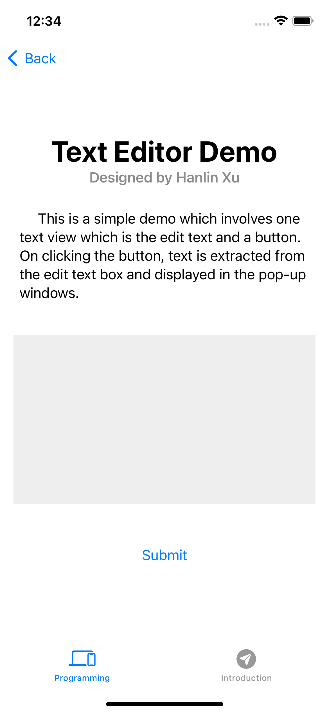
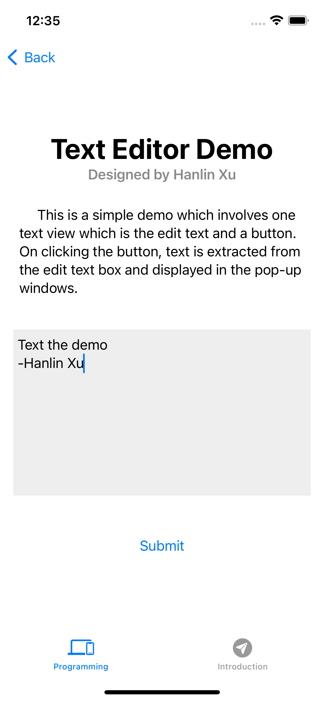
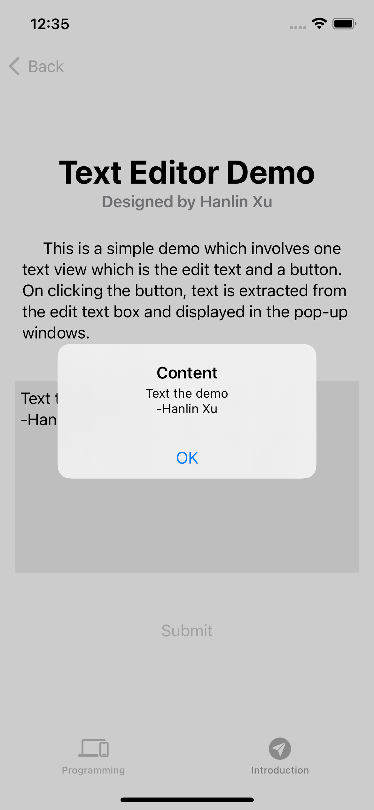

# Text Editor demo

This is a simple demo which involves one text view which is the edit text and a button. On clicking the button, text is extracted from the edit text box and displayed in the pop-up windows.

## Code

Comments have been provided to explain the code.

```
import SwiftUI

struct TextEditdemoView: View {
    @State var content = ""
    @State var isAlert = false
    
    init()
    {
        UITextView.appearance().backgroundColor = .clear
    }
    
    var body: some View {
        ScrollView{
            Text("Text Editor Demo")
                .font(.largeTitle)
                .fontWeight(.bold)
                .multilineTextAlignment(.center)
                .padding([.top, .leading, .trailing])
            
            Text("Designed by Hanlin Xu")
                .font(.headline)
                .foregroundColor(.secondary)
            
            Text("     This is a simple demo which involves one text view which is the edit text and a button. On clicking the button, text is extracted from the edit text box and displayed in the pop-up windows.")
                .font(.body)
                .multilineTextAlignment(.leading)
                .padding(.all)
            
            VStack{
                TextEditor(text: self.$content)
                    .background(Color.gray.opacity(0.15))
                    .frame(height:200)
                Spacer().frame(height: 50)
                // If variable isAlert is true, the botton will pop out the window and show the content in the text editor
                Button("Submit")
                {
                    self.isAlert = true
                }
                .alert(isPresented: $isAlert, content: {
                    Alert(title:Text("Content"),message: Text(content))
                })
            }.padding()
                    
        }
    }
}

struct TextEditdemoView_Previews: PreviewProvider {
    static var previews: some View {
        TextEditdemoView()
    }
}
```

## Screenshots

Following are few screenshots of this demo.

**First screenshot is text edition demo of the app.**



**Second screenshot is type in some character in grey box.**



**Third screenshot is result of this demo.**


