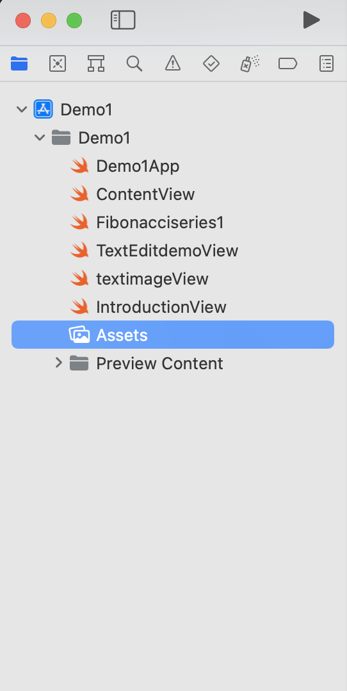
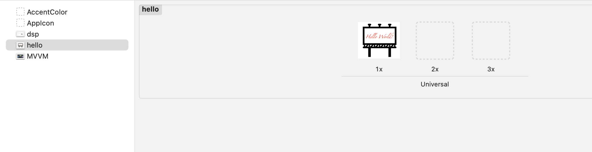

# Text Image Demo

It is a simple app with text view and image view.

For this demo you need to copy an image into the Assets folder of the project. For the Xcode, it will be really easy to make it.

First, you need to access to your Assets file like this.



Then, drop your image into the left white part and your image will be previewed in the right grey part.



After that you can access these images by using the following code. 

```
image("dsp")
```

## Code

You can build this app using the following code.

```
import SwiftUI

struct textimageView: View {
    var body: some View {
        VStack{
        Text("Text Image Demo")
                .font(.largeTitle)
                .fontWeight(.bold)
                .multilineTextAlignment(.center)
                .padding([.top, .leading, .trailing])
            
        Text("Designed by Hanlin Xu")
                .font(.headline)
                .foregroundColor(.secondary)
            
        Text("     This is a simple demo which involves text view and image views.")
                .font(.body)
                .multilineTextAlignment(.leading)
                .padding(.all)
            
        Image("dsp")
            .resizable()
            .padding([.leading, .bottom, .trailing])
            .scaledToFit()
        
        Image("hello")
            .resizable()
            .padding([.leading, .bottom, .trailing])
            .scaledToFit()
        }
    }
}

struct textimageView_Previews: PreviewProvider {
    static var previews: some View {
        textimageView()
    }
}
```
