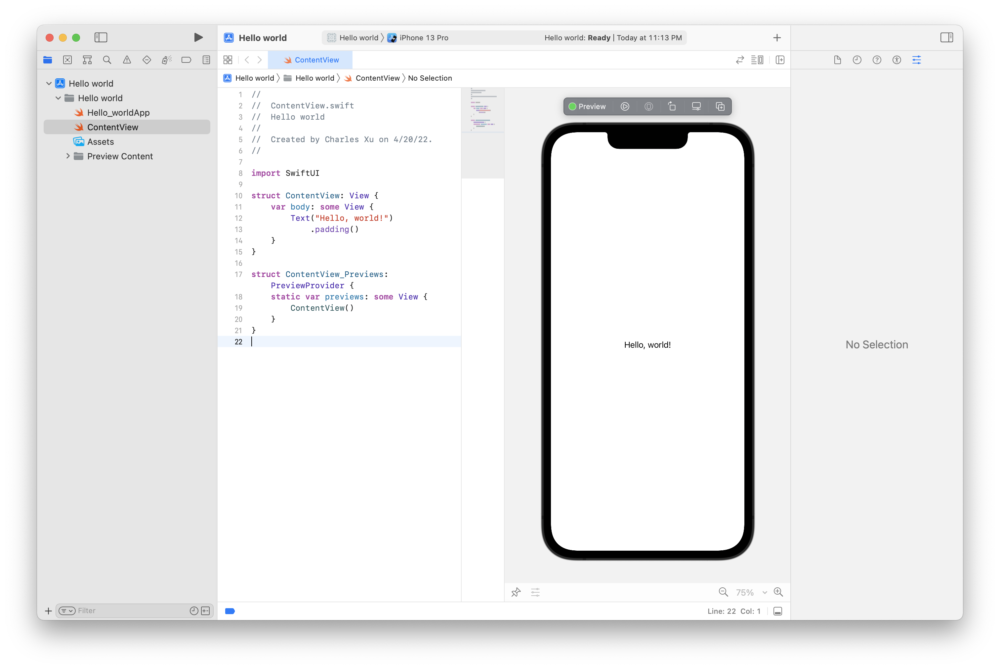
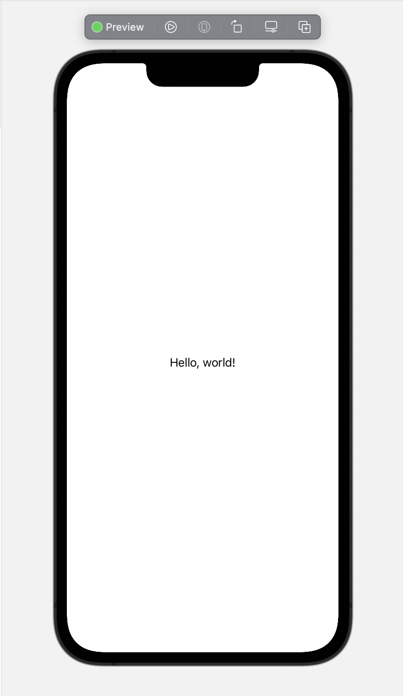

# [Swift](https://developer.apple.com/swift/) Basics

## Contents
1. [Introduction](#introduction)
2. [Environment](#environment)

## Introduction

Swift is a fantastic way to write software, whether it’s for phones, desktops, servers, or anything else that runs code. It’s a safe, fast, and interactive programming language that combines the best in modern language thinking with wisdom from the wider Apple engineering culture and the diverse contributions from its open-source community. The compiler is optimized for performance and the language is optimized for development, without compromising on either.

Swift is friendly to new programmers. It’s an industrial-quality programming language that’s as expressive and enjoyable as a scripting language. Writing Swift code in a playground lets you experiment with code and see the results immediately, without the overhead of building and running an app.

Swift defines away large classes of common programming errors by adopting modern programming patterns:

- Variables are always initialized before use.
- Array indices are checked for out-of-bounds errors.
- Integers are checked for overflow.
- Optionals ensure that nil values are handled explicitly.
- Memory is managed automatically.
- Error handling allows controlled recovery from unexpected failures.
 
Swift code is compiled and optimized to get the most out of modern hardware. The syntax and standard library have been designed based on the guiding principle that the obvious way to write your code should also perform the best. Its combination of safety and speed make Swift an excellent choice for everything from “Hello, world!” to an entire operating system.

Swift combines powerful type inference and pattern matching with a modern, lightweight syntax, allowing complex ideas to be expressed in a clear and concise manner. As a result, code is not just easier to write, but easier to read and maintain as well.

## Environment

Swift provides a platform for learning purpose and we are going to setup the same. You need xCode software to start your Swift coding. Once you are comfortable with the concepts of Swift, you can use xCode IDE for iOS/OS x application development.

Xcode is currently available at [here](https://developer.apple.com/xcode/). You could also download from appstore.

Now you have xCode installed on your machine. Next, open Xcode from the Application folder and proceed after accepting the terms and conditions. If everything is fine, you will get the following screen −


Select **Create a new Xcode Project** option and enter a name for project and select swift as your language. Finally, you will get the project window as follows −



Following is the code taken from the default Swift project window.

```
//
//  ContentView.swift
//  Hello world
//
//  Created by Charles Xu on 4/20/22.
//

import SwiftUI

struct ContentView: View {
    var body: some View {
        Text("Hello, world!")
            .padding()
    }
}

struct ContentView_Previews: PreviewProvider {
    static var previews: some View {
        ContentView()
    }
}
```

When the above program gets loaded, it should display the following result in simulator result area (Right Hand Side).



Congratulations, you have your Swift programming environment ready and you can proceed with your learning vehicle "Tutorials Point".

# Optionals

Swift also introduces **Optionals** type, which handles the absence of a value. Optionals say either "there is a value, and it equals x" or "there isn't a value at all".

An Optional is a type on its own, actually one of Swift’s new super-powered enums. It has two possible values, **None** and **Some(T)**, where **T** is an associated value of the correct data type available in Swift.

Here’s an optional Integer declaration −

```
var perhapsInt: Int?
```

Here’s an optional String declaration −

```
var perhapsStr: String?
```

The above declaration is equivalent to explicitly initializing it to nil which means no value −

```
var perhapsStr: String? = nil
```

Let's take the following example to understand how optionals work in Swift 4 −

```
var myString:String? = nil

if myString != nil {
   print(myString)
} else {
   print("myString has nil value")
}
```

When we run the above program using playground, we get the following result −

```
myString has nil value
```

Optionals are similar to using **nil** with pointers in Objective-C, but they work for any type, not just classes.

### Forced Unwrapping

If you defined a variable as **optional**, then to get the value from this variable, you will have to **unwrap** it. This just means putting an exclamation mark at the end of the variable.

Let's take a simple example −

```
var myString:String?

myString = "Hello, Swift!"

if myString != nil {
   print(myString)
} else {
   print("myString has nil value")
}
```

When we run the above program using playground, we get the following result −

```
Optional("Hello, Swift!")
```

Now let's apply unwrapping to get the correct value of the variable −

```
var myString:String?

myString = "Hello, Swift!"

if myString != nil {
   print( myString! )
} else {
   print("myString has nil value")
}
```

When we run the above program using playground, we get the following result.

```
Hello, Swift!
```

### Optional Binding

Use optional binding to find out whether an optional contains a value, and if so, to make that value available as a temporary constant or variable.

An optional binding for the if statement is as follows −

```
if let constantName = someOptional {
   statements
}
```

Let's take a simple example to understand the usage of optional binding −

```
var myString:String?
myString = "Hello, Swift!"

if let yourString = myString {
   print("Your string has - \(yourString)")
} else {
   print("Your string does not have a value")
}
```

When we run the above program using playground, we get the following result −

```
Your string has - Hello, Swift!
```
