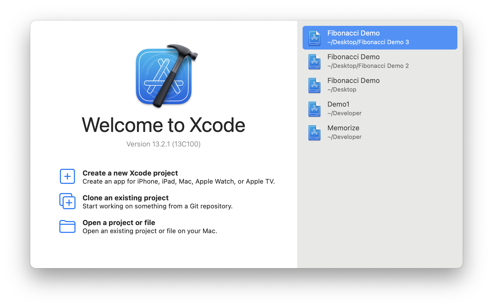
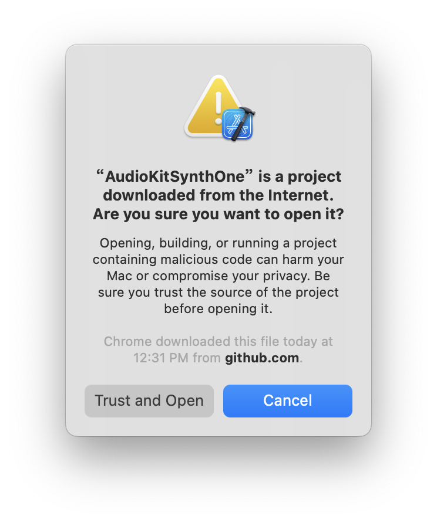
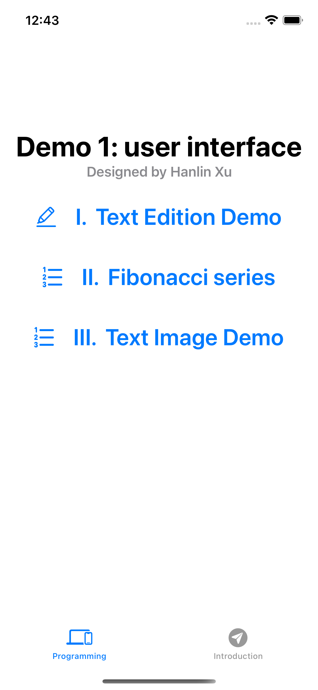
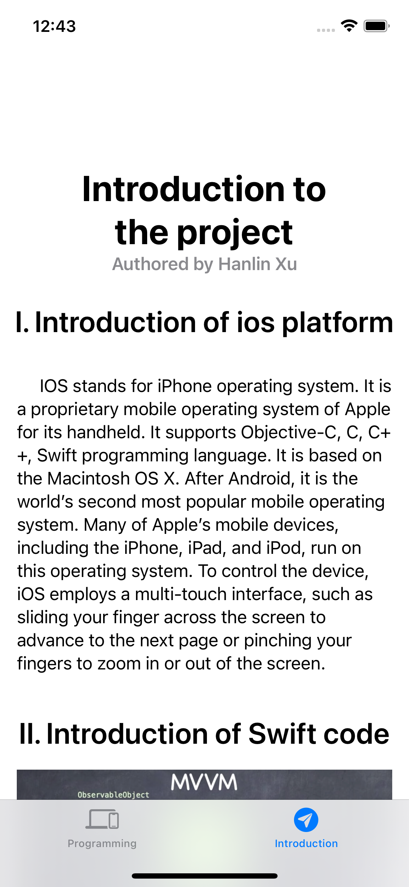
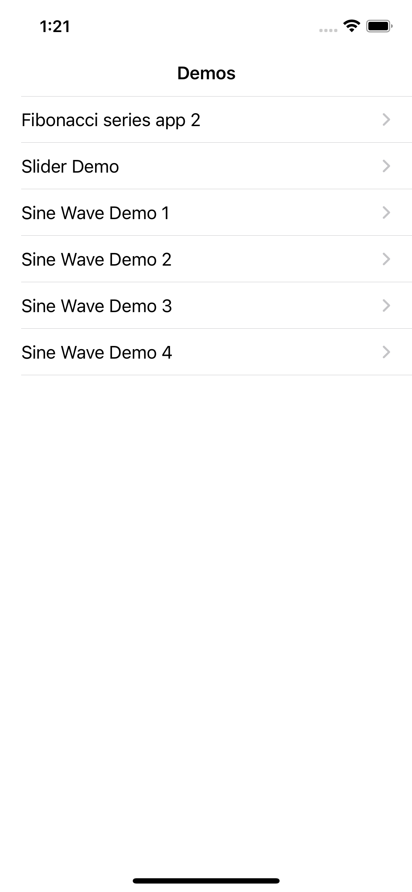

# Xcode Project

All the code could be found in my [Github](https://github.com/charles-xu-nyu/charles-xu-nyu.github.io/tree/main/xcode_project), feel free to download and run on your own PC.

## Open a existing project

Under this folder is my Xcode project file. You could just download and open it from the Xcode in your PC.

In order to open a exist project, you need to unzip the zip file, and open your Xcode and choose open a project or file.

When you click this, then choose the file with the suffix `.xcodeproj`.

Then choose Trust and Open.

I will upload three zip file.

## File 1 instruction

File 1 contains three demos, they are `Text Edit Demo`, `Fibonacci series app 1` and `Text Image Demo`.

In the left part of the project, you can click on each demo's name to access the demo.

In the right part of the project, you can see brief introdction of ios and this app.

## File 2 instruction

File 2 contains six demos, they are `Fibonacci series app 2`, `Slider Demo`, `Sine Wave Demo 1`, `Sine Wave Demo 2`, `Sine Wave Demo 3`, and `Sine Wave Demo 4`. You can click on each demo's name to access the demo.

## File 3 instruction

File 3 just contents 1 demo, which is the `Piano Simulator`, you could just press the keyboard to experience and listen to different Syllables of the piano.

