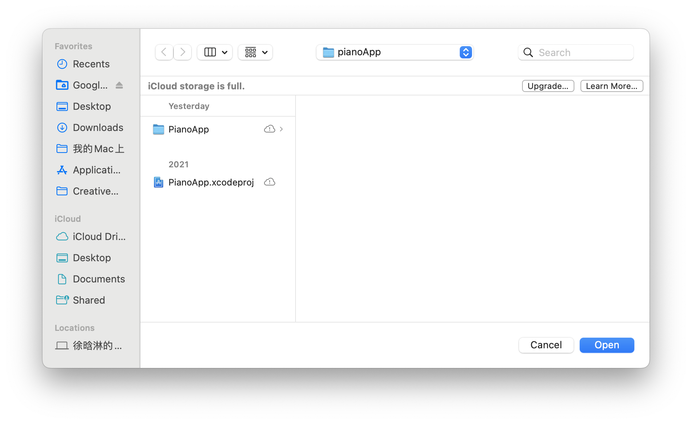

# Xcode Project

## Open a existing project

Under this folder is my Xcode project file. You could just download and open it from the Xcode in your PC.

In order to open a exist project, you need to unzip the zip file, and open your Xcode and choose open a project or file.

When you click this, then choose the file with the suffix `.xcodeproj`.

Then choose Trust and Open.

I will upload three zip file.

## File 1 instruction

File 1 contains three demos, they are `Text Edit Demo`, `Fibonacci series app 1` and `Text Image Demo`.

In the left part, you can click on each demo's name to access the demo.

